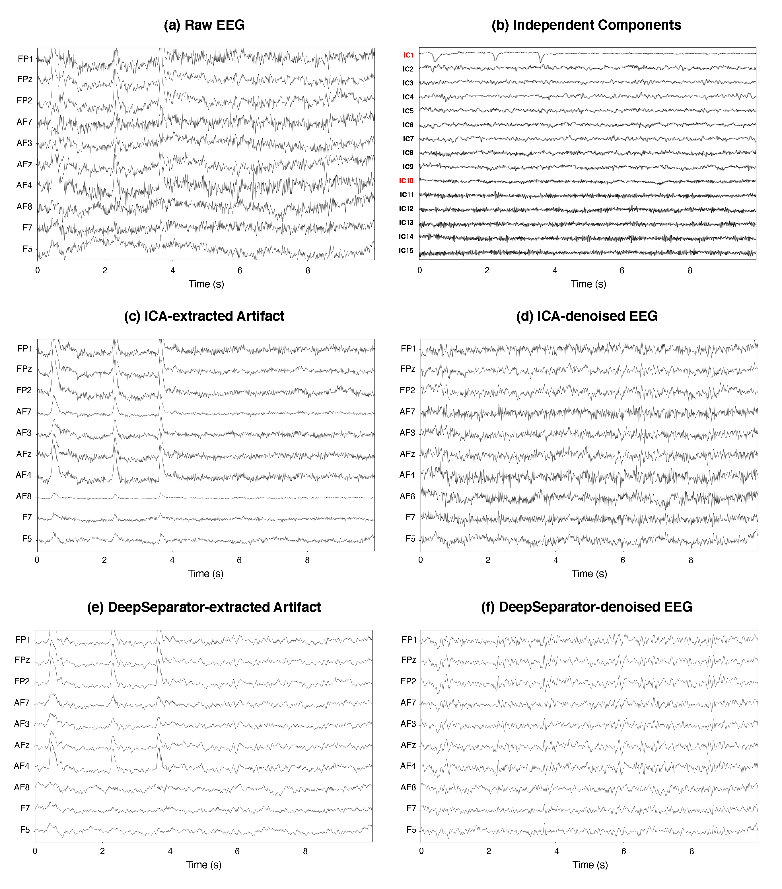

# DeepSeparator

## Introduction

DeepSeparator is a deep learning framework for EEG denoising and artifact extraction.

The goal of the repository is to provide an implementation of DeepSeparator and replicate the experiments in the paper.

 ## Getting Started

### Setup Enviroment

* [PyTorch](http://pytorch.org/) version = 1.9.0
* MNE = 0.22.1
* Python version = 3.6

### Model Training

1. data/generate_data.py for data generation

2. code/train.py for model training

3. code/predict.py for checking the EEG artifact removal performance

### Results

